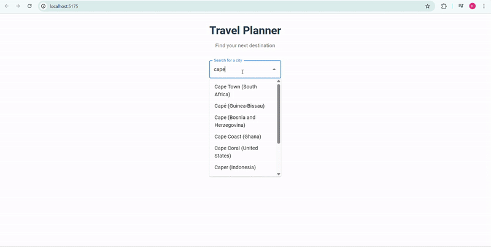

## Architecture & Technical Choices

**Backend:**
- Built with Node.js and TypeScript for type safety and maintainability.
- Exposes a GraphQL API (using Apollo Server) for flexible data queries and strong typing between frontend and backend.
- Integrates with external APIs for geocoding (city suggestions) and weather forecasts.

**Frontend:**
- Built with React and TypeScript for a modern, component-based UI.
- Uses Apollo Client for seamless GraphQL integration and state management.
- Vite is used for fast development and build tooling.

**Testing:**
- Jest is used for backend unit tests, especially for API and scoring logic.

## Omissions & Trade-offs

- No persistent database: All data is fetched live from external APIs and no user data is stored.
- Minimal error handling and validation.
- UI/UX is functional but not highly polished or responsive.

## Improvements & Extensions (Given More Time)

- Integrate a persistent database for storing user data and search history.
- Improve caching API results for faster loading time and better performance.
- Improve activity recommendations with smarter algorithms.
- Improve error handling, validation, and loading states in the UI.
- Add frontend unit tests.
- Enhance UI/UX with responsive design and accessibility improvements.
- Add deployment scripts and CI/CD for production readiness.
- Improve Type usage in both frontend and backend.

## Use of AI Tools

I used AI tools (such as ChatGPT and GitHub Copilot) to:
- Brainstorm and refine the project idea and feature set.
- Research and apply best practices for structuring, maintaining, and documenting the codebase.
- Assist with designing and implementing the algorithm for activity scoring based on weather data.

All AI generated suggestions were reviewed and adapted using my own judgment to ensure code quality, and maintainability for the project goals.

# Travel Planning App

This project is a full-stack travel planning application featuring:

- **Backend:** Node.js/TypeScript with a GraphQL API for city suggestions, weather forecasts, and activity recommendations.
- **Frontend:** React app that interacts with the backend via GraphQL to provide a seamless travel planning experience.

Below are instructions to run both the backend and frontend locally, as well as information about the included demo video.

## How to Run

### Backend
1. Open a terminal and navigate to the backend directory:
   ```sh
   cd ./backend
   ```
2. Install dependencies:
   ```sh
   npm install
   ```
3. Start the backend server in development mode:
   ```sh
   npm run dev
   ```

### Frontend
1. Open a new terminal and navigate to the frontend directory:
   ```sh
   cd ./frontend-app
   ```
2. Install dependencies:
   ```sh
   npm install
   ```
3. Start the frontend development server:
   ```sh
   npm run dev
   ```


## Demo

A demo of the application is included in the root of this repository:



You can view this GIF to see the application's features and user experience in action.

## App Screenshot

Below is a screenshot of the Travel Planner app in action:


